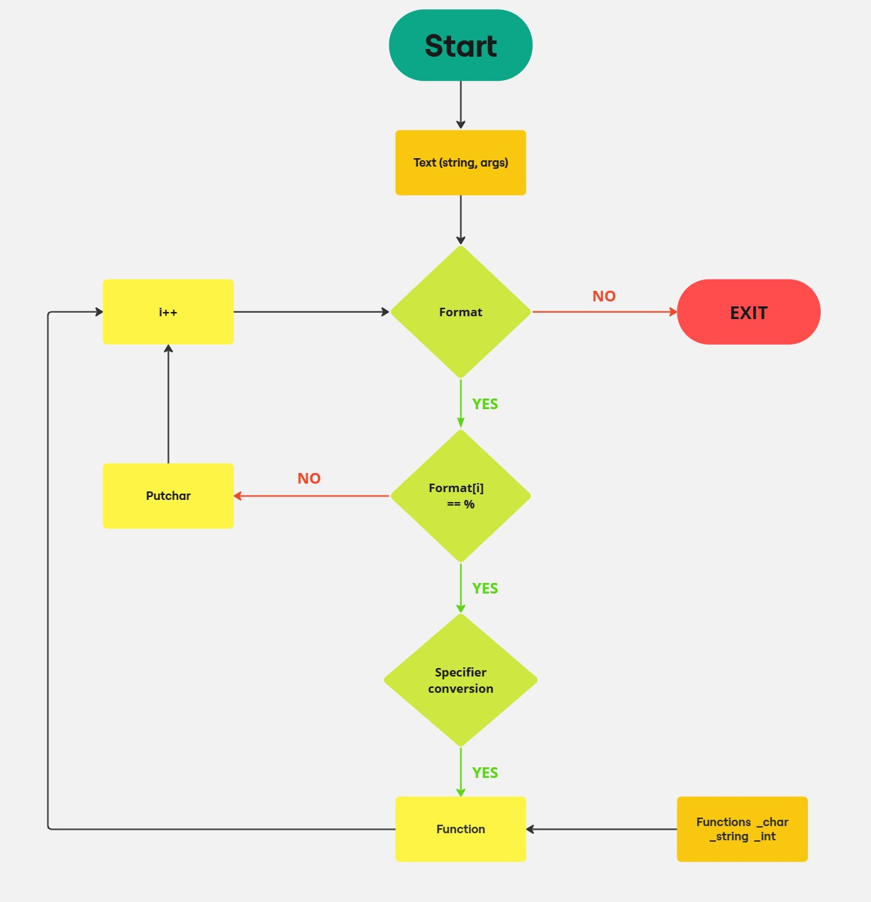

# Holbertonschool - printf

This is a new project to create a custom function _printf of the standard function printf in C language. This custom function handle the conversion specifiers to display a character, a string, a percent or an integer. 

## Conversion specifiers

| **Conversion specifiers** 	| **Data type** 	|
|---------------------------	|---------------	|
|             %c            	|      char     	|
|             %s            	|     string    	|
|             %%            	|    percent    	|
|             %i            	|    integer    	|
|             %d            	|    integer    	|

## Installation - Configuration

First, create a repository on your github and clone the link with your terminal.
Then, the best thing would be to create a flowchart to give your code a guideline.
You add a main function and a header file to introduce the library and all the functions called, and start creating your custom function _printf.
Compile your program with the command 

## Requirements for this project

* All the files were compiled to Ubuntu 22.04 using gcc
* The text editors were Vi or Vim
* All files must follow the betty coding style
* No more than 5 functions per file
* You are not allowed to use global variables
* Include the _putchar function in your code

## Structure 
The code must be as readable and clear as possible. Here are the functions used:

|                  **Functions**                  	|     **Functions specifiers**    	|
|:-----------------------------------------------:	|:-------------------------------:	|
|       int _printf(const char *format, ...)      	|   int _char(va_list args)  	|
| int _format(const char specifier, va_list args) 	|  int _string(va_list args) 	|
|               int _putchar(char c)              	| int _percent(va_list args) 	|
|                                                 	|   int _int(va_list args)   	|
|                                                   |   int unsigned(va_list args)|

## Examples

_printf("character is %c\n", 'P')

_printf("the string is %s\n", "Hello World")

_print("the percent is %%\n)

_printf("the integer is %i\n", '1')

_printf("the integer is %d\n '-2')

## Man page

For this custom function, we've also created a manual review to provide a clear explanation of our function, with the name "man_3_printf"
To test our code, Holberton School sent us a test program with which we validated our code.

## Flowchart

## Authors

